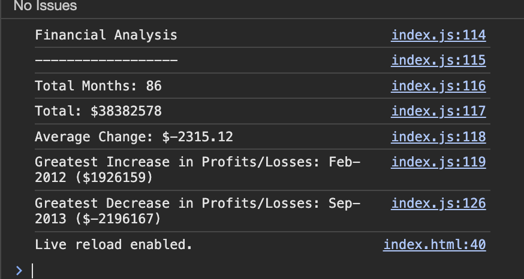

# Console-Finances

## Financial Analysis JavaScript
This JavaScript script is designed to analyse a dataset containing arrays. The script calculates key financial metrics and provides insightful analysis.

## Features:

## Total Months:
Calculates the total number of months included in the dataset.
## Net Total Amount:
Computes the net total amount of Profit/Losses over the entire period.
## Average Change:
Determines the average of the changes in Profit/Losses over the entire period.
Formula: Total Change / (Number of months - 1)
## Greatest Increase in Profit/Losses:
Identifies the month and amount with the greatest increase in Profit/Losses over the entire period.
## Greatest Decrease in Profit/Losses:
Finds the month and amount with the greatest decrease in Profit/Losses over the entire period.

Financial Analysis 
----------------
Total Months: 86
Total: $38382578
Average Change: -2315.12
Greatest Increase in Profits/Losses: Feb-2012 ($1926159)
Greatest Decrease in Profits/Losses: Sep-2013 ($-2196167)

## How To Use
Run the JavaScript code with the provided dataset to perform the financial analysis.

The script will output the financial analysis results, including total months, net total amount, average change, greatest increase, and greatest decrease in Profit/Losses, to the console.

## Technologies Used

HTML
CSS
JavaScript

## Screenshots

## License
Distributed under the MIT License. See LICENSE for more information. IT License Copyright (c) 2024 Rehyan Permission is hereby granted, free of charge, to any person obtaining a copy of this software and associated documentation files (the "Software"), to deal in the Software without restriction, including without limitation the rights to use, copy, modify, merge, publish, distribute, sublicense, and/or sell copies of the Software, and to permit persons to whom the Software is furnished to do so, subject to the following conditions: The above copyright notice and this permission notice shall be included in all copies or substantial portions of the Software. THE SOFTWARE IS PROVIDED "AS IS", WITHOUT WARRANTY OF ANY KIND, EXPRESS OR IMPLIED, INCLUDING BUT NOT LIMITED TO THE WARRANTIES OF MERCHANTABILITY, FITNESS FOR A PARTICULAR PURPOSE AND NON-INFRINGEMENT. IN NO EVENT SHALL THE AUTHORS OR COPYRIGHT HOLDERS BE LIABLE FOR ANY CLAIM, DAMAGES OR OTHER LIABILITY, WHETHER IN AN ACTION OF CONTRACT, TORT OR OTHERWISE, ARISING FROM, OUT OF OR IN CONNECTION WITH THE SOFTWARE OR THE USE OR OTHER DEALINGS IN THE SOFTWARE.